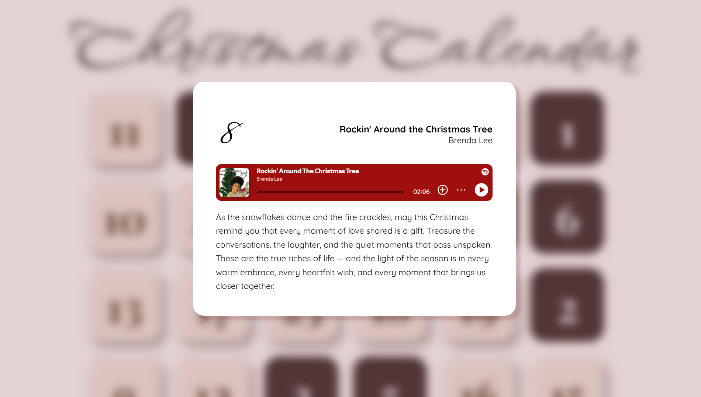
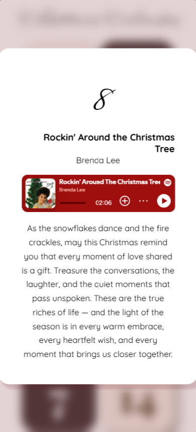

# 🎄 Christmas Calendar: Ein interaktiver Adventskalender  


Dieses Projekt ist ein interaktiver Weihnachtskalender, der jeden Tag eine besondere Überraschung bietet. Benutzer können jeden Tag ein Türchen öffnen, um ein weihnachtliches Lied mit einer kurzen Botschaft zu entdecken. Die Anwendung verbindet ein ansprechendes Design mit funktionaler React-Programmierung und einer Spotify-Integration.

---

## 🛠️ Features  

- **Interaktive Türchen:** Öffne jeden Tag ein Türchen und entdecke eine neue weihnachtliche Überraschung.  
- **Spotify-Integration:** Jedes Türchen spielt ein ausgewähltes Weihnachtslied direkt über die Spotify-API ab.  
- **Individuelle Texte:** Jede Tür bietet eine persönliche Botschaft, um die Weihnachtszeit noch besinnlicher zu machen.  
- **Responsives Design:** Die Anwendung ist für verschiedene Bildschirmgrößen optimiert.  

---

## 📂 Projektstruktur  

- **Frontend:**  
  - Entwickelt mit React für dynamische Interaktivität.  
  - Styling mit CSS für eine weihnachtliche, minimalistische Oberfläche.  

- **State Management:**  
  - Nutzung von React Hooks (`useState`, `useEffect`) für die Verwaltung des Anwendungszustands.  

- **API-Integration:**  
  - Spotify-API für die Einbettung von Musik-Playern direkt in die Anwendung.  

---
## 🖼️ Screenshots  

### 1. Startseite: Desktop-Ansicht  
Die Desktop-Version zeigt den Adventskalender in einem Raster mit vier Spalten und großzügigem Abstand zwischen den Türchen.  


---

### 2. Startseite: Mobile-Ansicht  
In der mobilen Version wird der Kalender in einem Raster mit zwei Spalten angezeigt. Die Türchen sind kleiner, um den Platz optimal zu nutzen.  


---

### 3. Geöffnetes Türchen: Desktop-Ansicht  
Das Popup-Fenster zeigt ein geöffnetes Türchen mit einem Titel, einem eingebetteten Spotify-Player und einer Weihnachtsbotschaft.  


---

### 4. Geöffnetes Türchen: Mobile-Ansicht  
In der mobilen Version passt sich das Popup-Fenster der Bildschirmgröße an, um eine optimale Darstellung zu gewährleisten.  


---

## 🚀 Technologien  

- ⚛️ **Frontend:** React mit JavaScript  
- 🎨 **Styling:** CSS mit Variablen und Media Queries  
- 🌐 **API:** Spotify-API für das Abspielen von Musik  
- 🔧 **Tools:** Node.js, npm, JSON-Server (für Daten)  

---

## 📋 Software-Entwicklung und Planung  

Dieses Projekt wurde mit folgenden Zielen entwickelt:  

1. **Interaktivität:** Schaffung eines dynamischen Nutzererlebnisses durch React-Komponenten.  
2. **API-Integration:** Abruf und Einbettung von Spotify-Musik in die Anwendung.  
3. **Design-Fokus:** Minimalistisches und gleichzeitig festliches Design für die Weihnachtszeit.  

---

## 🛠️ Lokale Installation  

### 1. Projekt klonen  
Klonen Sie das Repository auf Ihre lokale Maschine:  
```bash
    git clone https://github.com/dein-benutzername/ christmas-calendar.git
    cd christmas-calendar
```

### 2. Abhängigkeiten installieren
Installieren Sie alle benötigten Abhängigkeiten:
```bash
    npm install
```

### 3. JSON-Server starten
Starten Sie den JSON-Server, um die Daten für die Türchen bereitzustellen:
```bash
    npx json-server --watch calendar.json --port 8000
```

### 4. Anwendung starten
Starten Sie die React-Anwendung:
```bash
    npm start
```
Die Anwendung ist nun unter http://localhost:3000 verfügbar.

---

# 🎯 Nutzung

1. Öffnen Sie die Anwendung im Browser.
2. Klicken Sie auf ein Türchen, um den Inhalt zu entdecken.
3. Genießen Sie die Weihnachtsmusik und die Botschaften.

---

## 📜 Lizenz

Dieses Projekt steht unter der [MIT-Lizenz](LICENSE).

---

## 📞 Kontakt

Bei Fragen oder Feedback können Sie mich über [GitHub](https://github.com/meelinaa) oder [E-Mail](mailto:melinakiefer@hotmail.de) erreichen. Ich freue mich über Rückmeldungen!
